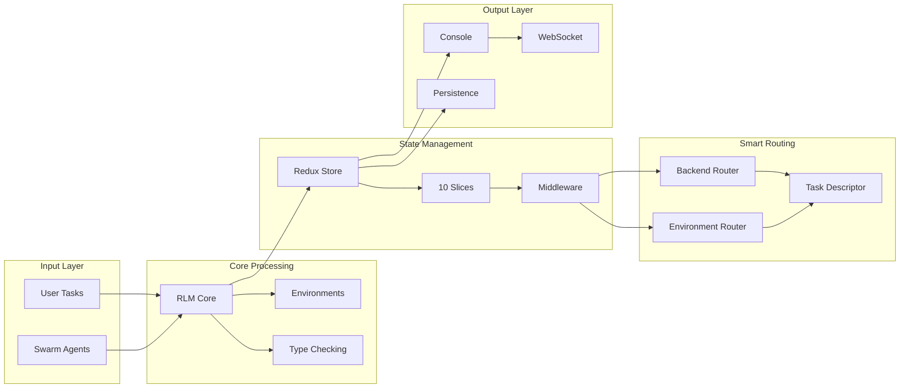
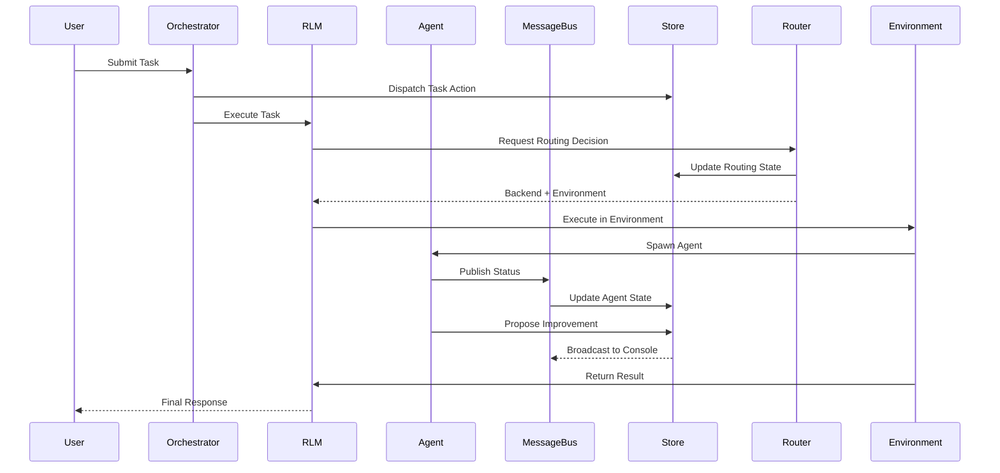

# Self-Improving Swarm System Architecture

```mermaid
flowchart TB
    subgraph Core["Core System"]
        subgraph RLM["Recursive Language Model"]
            RLM_CORE["rlm/core/rlm.py"]
            LM_HANDLER["lm_handler.py"]
            COMMS["comms_utils.py"]
            TYPES["types.py"]
        end

        subgraph Clients["Backend Clients"]
            OPENAI["openai.py"]
            ANTHROPIC["anthropic.py"]
            GEMINI["gemini.py"]
            AZURE["azure_openai.py"]
            LITE_LLM["litellm.py"]
            PORTKEY["portkey.py"]
        end

        subgraph Environments["Execution Environments"]
            LOCAL_REPL["local_repl.py"]
            MODAL_REPL["modal_repl.py"]
            DOCKER_REPL["docker_repl.py"]
            E2B_REPL["e2b_repl.py"]
            DAYTONA["daytona_repl.py"]
            LAYER1["layer1_bootstrap.py"]
        end
    end

    subgraph Swarm["Self-Improving Swarm"]
        subgraph Agents["Agent Management"]
            BASE_AGENT["agents/base/base_agent.py"]
            SWARM_AGENT["agents/base/swarm_agent.py"]
            EXECUTOR["agents/executor.py"]
            MANAGER["agents/manager.py"]
            VERIF_AGENT["agents/verification_agent_factory.py"]
        end

        subgraph Tasks["Task Execution"]
            TASK["tasks/task.py"]
            TASK_QUEUE["tasks/task_queue.py"]
            TASK_EXEC["tasks/task_executor.py"]
            WORKFLOW["tasks/workflow.py"]
        end

        subgraph Messaging["Message Bus"]
            MSG_TYPES["messaging/message_types.py"]
            BROKER["messaging/message_broker.py"]
        end

        subgraph Improvements["Self-Improvement"]
            REGISTRY["improvements/improvement_registry.py"]
        end

        subgraph Tools["Dynamic Tool Creation"]
            TOOL_REG["tools/registry.py"]
            TOOL_SANDBOX["tools/sandbox.py"]
            TOOL_VALID["tools/validation.py"]
        end
    end

    subgraph State["Redux State Management"]
        subgraph Slices["State Slices"]
            VERIF_SLICE["verification_slice.py"]
            ROUTING_SLICE["routing_slice.py"]
            TASKS_SLICE["tasks_slice.py"]
            PERMS_SLICE["permissions_slice.py"]
            TOOLS_SLICE["tools_slice.py"]
            IMPRV_SLICE["improvements_slice.py"]
            AGENTS_SLICE["agents_slice.py"]
            MSG_SLICE["messages_slice.py"]
            SYSTEM_SLICE["system_slice.py"]
            UI_SLICE["ui_slice.py"]
        end

        STORE["redux/store.py"]
        MIDDLEWARE["redux/middleware/"]
    end

    subgraph Routing["Dynamic Routing"]
        BACKEND_ROUTER["routing/backend_router.py"]
        ENV_ROUTER["routing/environment_router.py"]
        TASK_DESC["routing/task_descriptor.py"]
        BACKEND_FACT["routing/backend_factory.py"]
        ENV_FACT["routing/environment_factory.py"]
    end

    subgraph Console["Interactive Console"]
        WS_BRIDGE["console/ws_bridge.py"]
        WS_SERVER["console/websocket.py"]
        ORCHESTRATOR["app/orchestrator.py"]
        CLI["console/cli.py"]
        CONSOLE_UI["console/console.py"]
    end

    subgraph Persistence["Persistence Layer"]
        JSON_STORE["persistence/json_storage.py"]
        PERSIST_MANAGER["persistence/manager.py"]
        SERIALIZERS["persistence/serializers.py"]
        INTEGRATIONS["persistence/integrations.py"]
    end

    subgraph TypeChecking["Type Checking System"]
        BASE_TC["typechecking/base.py"]
        REGISTRY_TC["typechecking/registry.py"]
        CONFIG_TC["typechecking/config.py"]
        RESULT_TC["typechecking/result.py"]
        EXCEPTIONS_TC["typechecking/exceptions.py"]
        CONFIG_LOADER["typechecking/config_loader.py"]

        subgraph Haskell["Haskell Checker"]
            HASKELL_CHECK["typechecking/haskell/haskell_checker.py"]
            GHC_CHECK["typechecking/haskell/ghc_checker.py"]
            H_RESULT["typechecking/haskell/result.py"]
        end

        subgraph Lean["Lean Checker"]
            LEAN_CHECK["typechecking/lean/lean_checker.py"]
            LAKE_CHECK["typechecking/lean/lake_checker.py"]
            L_RESULT["typechecking/lean/result.py"]
        end
    end

    %% Connections
    RLM_CORE --> LM_HANDLER
    LM_HANDLER --> COMMS
    COMMS --> Clients

    RLM_CORE --> Environments
    Environments --> LAYER1

    RLM_CORE --> Agents
    Agents --> Tasks
    Agents --> Messaging
    Agents --> Improvements

    Tasks --> Tools
    Tools --> TOOL_REG
    TOOL_REG --> TOOL_SANDBOX
    TOOL_REG --> TOOL_VALID

    RLM_CORE --> STORE
    STORE --> Slices
    Slices --> MIDDLEWARE

    STORE --> Routing
    Routing --> BACKEND_ROUTER
    Routing --> ENV_ROUTER
    Routing --> TASK_DESC

    STORE --> Console
    Console --> WS_BRIDGE
    Console --> ORCHESTRATOR

    STORE --> Persistence
    Persistence --> JSON_STORE
    Persistence --> PERSIST_MANAGER

    RLM_CORE --> TypeChecking
    TypeChecking --> BASE_TC
    BASE_TC --> REGISTRY_TC
    REGISTRY_TC --> Haskell
    REGISTRY_TC --> Lean
```



## System Component Overview



## Data Flow



## Module Dependency Tree

```
rlm/
├── core/
│   ├── rlm.py              [depends on: lm_handler, comms_utils, types]
│   ├── lm_handler.py       [depends on: clients/*]
│   └── comms_utils.py
├── environments/
│   ├── base_env.py
│   ├── local_repl.py       [depends on: layer1_bootstrap]
│   ├── layer1_bootstrap.py [depends on: typechecking/*]
│   └── ...
├── typechecking/
│   ├── base.py             [interface]
│   ├── registry.py          [depends on: base.py]
│   ├── haskell/
│   │   ├── haskell_checker.py
│   │   └── ghc_checker.py
│   └── lean/
│       ├── lean_checker.py
│       └── lake_checker.py
├── agents/
│   ├── base/
│   │   ├── base_agent.py
│   │   └── swarm_agent.py
│   ├── executor.py
│   └── manager.py
├── tasks/
│   ├── task.py
│   ├── task_queue.py
│   ├── task_executor.py
│   └── workflow.py
├── messaging/
│   ├── message_types.py
│   └── message_broker.py
├── improvements/
│   └── improvement_registry.py
├── tools/
│   ├── registry.py
│   ├── sandbox.py
│   └── validation.py
├── routing/
│   ├── backend_router.py    [depends on: backend_factory]
│   ├── environment_router.py
│   └── task_descriptor.py
├── persistence/
│   ├── base.py
│   ├── json_storage.py
│   ├── manager.py
│   └── serializers.py
├── redux/
│   ├── store.py
│   └── slices/
│       ├── verification_slice.py
│       ├── routing_slice.py
│       ├── tasks_slice.py
│       ├── permissions_slice.py
│       ├── tools_slice.py
│       ├── improvements_slice.py
│       ├── agents_slice.py
│       ├── messages_slice.py
│       ├── system_slice.py
│       └── ui_slice.py
└── console/
    ├── ws_bridge.py
    ├── websocket.py
    └── orchestrator.py
```