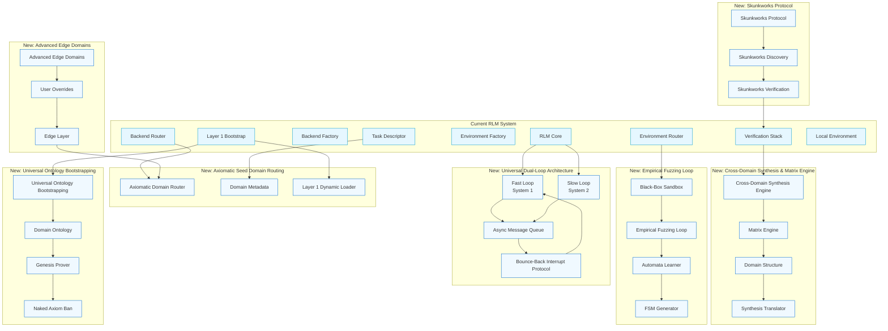
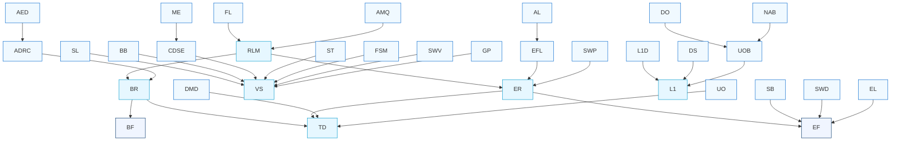

# Architecture Overview: Formalization Domain Structure Integration

## High-Level Architecture Diagram

## Key Integration Points and Data Flow

### 1. Dual-Loop Architecture Integration
- **Fast Loop (System 1)**: Integrates with existing RLM Core for rapid generation and exploration
- **Slow Loop (System 2)**: Connects to existing Verification Stack for formal verification
- **Async Message Queue**: Bridges the two loops, enabling concurrent operation
- **Bounce-Back Interrupt Protocol**: Connects to existing Redux middleware for state management

### 2. Axiomatic Seed Domain Routing Integration
- **Domain Router**: Extends existing Backend Router with domain-specific routing logic
- **Domain Metadata**: Enhances existing Task Descriptor with domain classification
- **Dynamic Layer 1 Loader**: Extends existing Layer 1 Bootstrap for dynamic library loading

### 3. Cross-Domain Synthesis Integration
- **Synthesis Engine**: Connects to existing Verification Stack for multi-domain theorem proving
- **Matrix Engine**: Integrates with existing Redux state management for cross-domain state
- **Domain Structure**: Extends existing Layer 1 structures for cross-domain representation
- **Synthesis Translator**: Connects to existing verification agents for translation

### 4. Empirical Fuzzing Loop Integration
- **Black-Box Sandbox**: Extends existing Environment Router for isolated fuzzing
- **Automata Learner**: Integrates with existing Verification Stack for FSM learning
- **FSM Generator**: Connects to existing Layer 1 Bootstrap for formal representation

### 5. Skunkworks Protocol Integration
- **Skunkworks Discovery**: Extends existing Environment Router for isolated exploration
- **Skunkworks Verification**: Connects to existing Verification Stack for hypothesis testing
- **Protocol**: Integrates with existing Redux middleware for state management

### 6. Universal Ontology Bootstrapping Integration
- **Domain Ontology**: Extends existing Layer 1 Bootstrap for novel domains
- **Genesis Prover**: Connects to existing Verification Stack for consistency proofs
- **Naked Axiom Ban**: Integrates with existing verification middleware for safety

### 7. Advanced Edge Domains Integration
- **User Overrides**: Extends existing Task Descriptor for user-defined axioms
- **Edge Layer**: Connects to existing Environment Router for specialized edge environments
- **Domain Extensions**: Integrates with existing Domain Router for edge domain support

## Component Dependency Graph

## Integration Principles

1. **Non-Disruptive Design**: All new components are optional and activated only when configuration is provided
2. **Extensibility**: New components extend existing interfaces rather than replacing them
3. **Backward Compatibility**: Existing functionality remains unchanged unless explicitly configured
4. **Incremental Adoption**: Components can be adopted incrementally without requiring all-at-once migration
5. **Clear Separation**: New functionality is clearly separated from existing code with well-defined interfaces