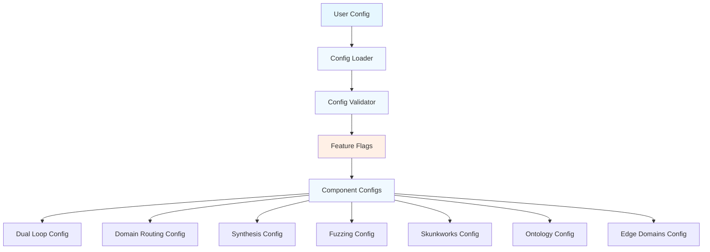
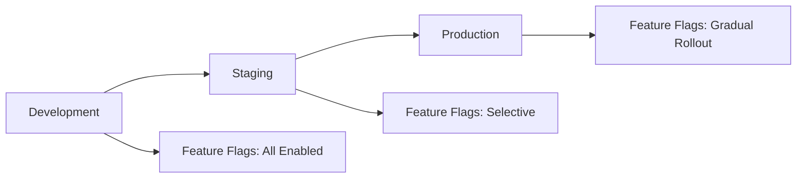

# Configuration & Deployment

## Overview

This document defines the configuration management and deployment strategy for the Formalization Domain Structure integration. It covers new configuration files, migration strategies, feature flags, and deployment procedures.

---

## Configuration Management

### Configuration Architecture



### Configuration Files

#### 1. Base Configuration

**File**: `config/base.yaml`

**Purpose**: Base configuration with default values

**Content**:
```yaml
version: "1.0"
environment: "development"
logging:
  level: "INFO"
  format: "json"
  file: "./logs/rlm.log"
  
feature_flags:
  dual_loop: false
  domain_routing: false
  cross_domain_synthesis: false
  empirical_fuzzing: false
  skunkworks: false
  universal_ontology: false
  advanced_edge_domains: false
```

#### 2. Dual-Loop Configuration

**File**: `config/dual-loop.yaml`

**Purpose**: Configuration for dual-loop architecture

**Content**:
```yaml
version: "1.0"
fast_loop:
  enabled: true
  max_iterations: 30
  stream_to_ui: true
  agents:
    - type: "architect"
      backend: "openai"
      model: "gpt-4"
    - type: "draftsman"
      backend: "openai"
      model: "gpt-4"
    - type: "research"
      backend: "openai"
      model: "gpt-3.5-turbo"
  
slow_loop:
  enabled: true
  verification_timeout: 300
  max_concurrent: 3
  agents:
    - type: "autoformalization"
      backend: "openai"
      model: "gpt-4"
    - type: "verifier"
      backend: "claude"
      model: "claude-3-opus"

message_queue:
  max_size: 100
  persistence_path: "./data/queue"
  priority_levels: ["high", "normal", "low"]
  persistence_enabled: true

interrupt_protocol:
  enabled: true
  max_retries: 3
  error_translation: true
  translation_timeout: 60
```

#### 3. Domain Routing Configuration

**File**: `config/domain-routing.yaml`

**Purpose**: Configuration for domain-based routing

**Content**:
```yaml
version: "1.0"
domains:
  math:
    keywords: ["theorem", "proof", "algebra", "calculus", "geometry"]
    layer1_imports: ["Mathlib.All"]
    research_sources: ["arXiv:math", "zbMATH", "IACR"]
    backend: "openai"
    model: "gpt-4"
  
  physics:
    keywords: ["force", "energy", "mass", "acceleration", "mechanics"]
    layer1_imports: ["SciLean", "PhysLib", "Mathlib.Analysis"]
    research_sources: ["NIST", "IEEE Xplore", "ASM"]
    backend: "claude"
    model: "claude-3-opus"
  
  software:
    keywords: ["algorithm", "code", "api", "software", "programming"]
    layer1_imports: ["Batteries", "Std", "Lean.Meta"]
    research_sources: ["ACM Digital Library", "IEEE CS", "arXiv:cs"]
    backend: "openai"
    model: "gpt-4"
  
  chemistry:
    keywords: ["molecule", "reaction", "compound", "element", "chemical"]
    layer1_imports: ["ChemLean", "PhysLib.Thermodynamics"]
    research_sources: ["PubChem", "ChemRxiv", "Materials Project"]
    backend: "claude"
    model: "claude-3-opus"
  
  finance:
    keywords: ["market", "price", "trade", "economy", "financial"]
    layer1_imports: ["Mathlib.Probability", "Mathlib.MeasureTheory"]
    research_sources: ["SSRN", "NBER", "arXiv:q-fin"]
    backend: "openai"
    model: "gpt-4"

classification:
  default_domain: "general"
  confidence_threshold: 0.7
  fallback_strategy: "second_highest"
  use_llm_classification: true

dynamic_loading:
  cache_libraries: true
  cache_path: "./data/layer1_cache"
  max_loaded_domains: 5
  preload_domains: ["math", "physics", "software"]
```

#### 4. Cross-Domain Synthesis Configuration

**File**: `config/cross-domain-synthesis.yaml`

**Purpose**: Configuration for cross-domain synthesis

**Content**:
```yaml
version: "1.0"
synthesis:
  max_domains: 5
  validation_timeout: 600
  strict_type_checking: true
  allow_user_overrides: true
  synthesis_timeout: 300

matrix_engine:
  max_matrix_size: 1000
  operation_timeout: 300
  parallel_processing: true
  cache_results: true
  cache_path: "./data/matrix_cache"

genesis_prover:
  max_proof_attempts: 10
  proof_timeout: 600
  require_all_invariants: true
  allow_partial_proofs: false
  proof_cache_enabled: true

type_mappings:
  default_mappings: true
  custom_mappings_path: "./config/type_mappings.yaml"
  strict_mode: true
  allow_auto_mapping: true
```

#### 5. Empirical Fuzzing Configuration

**File**: `config/empirical-fuzzing.yaml`

**Purpose**: Configuration for empirical fuzzing

**Content**:
```yaml
version: "1.0"
fuzzing:
  max_iterations: 1000
  timeout_per_probe: 300
  max_concurrent_probes: 10
  strict_sandboxing: true
  enable_logging: true

sandbox:
  network_isolation: true
  filesystem_isolation: true
  resource_limits:
    cpu_cores: 1
    memory_mb: 2048
    timeout_seconds: 300
  sandbox_type: "docker"

automata_learning:
  algorithm: "angluin_lstar"
  equivalence_test_count: 1000
  confidence_threshold: 0.95
  max_states: 100
  learning_timeout: 600

fsm_generation:
  target_language: "haskell"
  include_proofs: true
  validate_completeness: true
  output_path: "./data/discovered_fsms"
  format: "lean"
```

#### 6. Skunkworks Configuration

**File**: `config/skunkworks.yaml`

**Purpose**: Configuration for Skunkworks protocol

**Content**:
```yaml
version: "1.0"
skunkworks:
  discovery_timeout: 1800
  justification_timeout: 1200
  max_iterations: 50
  enable_internet: true
  enable_heuristics: true

discovery_phase:
  allow_unverified_code: true
  enable_heuristics: true
  confidence_threshold: 0.8
  max_experiments: 100
  experiment_timeout: 60

justification_phase:
  strict_verification: true
  require_formal_proofs: true
  allow_partial_verification: false
  proof_timeout: 600
  verification_attempts: 3

environment:
  sandbox_type: "docker"
  resource_limits:
    cpu_cores: 2
    memory_mb: 4096
    disk_gb: 10
  network_access: true
  package_installation: true
  cleanup_after_task: true
```

#### 7. Universal Ontology Configuration

**File**: `config/universal-ontology.yaml`

**Purpose**: Configuration for universal ontology bootstrapping

**Content**:
```yaml
version: "1.0"
ontology:
  bootstrap_timeout: 900
  max_invariants: 50
  strict_consistency: true
  allow_user_overrides: true
  enable_caching: true

domain_zero:
  default_structure: true
  auto_extract_types: true
  generate_initial_proofs: true
  proof_timeout: 600
  max_structure_depth: 10

naked_axiom_ban:
  enforce_strictly: true
  allow_user_overrides: true
  override_validation: true
  ban_error_message: "Use structures instead of naked axioms"
  check_mode: "static"

genesis_prover:
  max_proof_attempts: 5
  proof_timeout: 300
  require_inhabitation: true
  allow_partial_proofs: false
  proof_cache_enabled: true
```

#### 8. Advanced Edge Domains Configuration

**File**: `config/advanced-edge-domains.yaml`

**Purpose**: Configuration for advanced edge domains

**Content**:
```yaml
version: "1.0"
edge_domains:
  cyber_sec:
    keywords: ["vulnerability", "exploit", "security", "penetration", "malware"]
    layer1_imports: ["Lean-SMT", "Mathlib.Data.BitVec"]
    research_sources: ["CVE MITRE", "RFCs", "Exploit-DB"]
    environment: "isolated_docker"
    enabled: true
  
  reverse_engineering:
    keywords: ["reverse", "disassemble", "binary", "protocol", "decompile"]
    layer1_imports: ["Mathlib.Data.BitVec", "Mathlib.Logic"]
    research_sources: ["GitHub Security", "Phrack", "RE Blogs"]
    environment: "isolated_modal"
    enabled: true
  
  hardware_discovery:
    keywords: ["hardware", "device", "driver", "interface", "firmware"]
    layer1_imports: ["Mathlib.Data.BitVec", "PhysLib.Hardware"]
    research_sources: ["Datasheets", "Hardware Forums", "Vendor Docs"]
    environment: "hardware_sandbox"
    enabled: true

user_overrides:
  enable_overrides: true
  override_validation: true
  max_overrides_per_task: 10
  override_syntax: "<axioms>...</axioms>"
  require_explicit_approval: true

edge_environments:
  cyber_sec:
    sandbox_type: "docker"
    network_isolation: true
    resource_limits:
      cpu_cores: 1
      memory_mb: 2048
    tools: ["nmap", "metasploit", "wireshark"]
  
  reverse_engineering:
    sandbox_type: "modal"
    network_access: false
    tools: ["ghidra", "ida", "radare2", "binwalk"]
    resource_limits:
      cpu_cores: 2
      memory_mb: 4096
  
  hardware_discovery:
    sandbox_type: "hardware"
    hardware_access: true
    tools: ["logic_analyzer", "oscilloscope", "protocol_analyzer"]
    resource_limits:
      cpu_cores: 1
      memory_mb: 2048
```

### Configuration Validation

**File**: `rlm/config/config_validator.py`

**Purpose**: Validate configuration files

**Implementation**:
```python
from typing import Dict, Any
import yaml

class ConfigValidator:
    def __init__(self, schema_path: str):
        with open(schema_path, 'r') as f:
            self.schema = yaml.safe_load(f)
    
    def validate(self, config: Dict[str, Any]) -> ValidationResult:
        """Validate configuration against schema."""
        errors = []
        warnings = []
        
        # Validate version
        if 'version' not in config:
            errors.append("Missing required field: version")
        
        # Validate feature flags
        if 'feature_flags' in config:
            for flag, value in config['feature_flags'].items():
                if not isinstance(value, bool):
                    errors.append(f"Feature flag {flag} must be boolean")
        
        # Validate component configs
        for component in ['dual_loop', 'domain_routing', 'synthesis']:
            if component in config:
                component_errors = self._validate_component(
                    config[component], 
                    self.schema.get(component, {})
                )
                errors.extend(component_errors)
        
        return ValidationResult(
            valid=len(errors) == 0,
            errors=errors,
            warnings=warnings
        )
    
    def _validate_component(self, config: Dict, schema: Dict) -> List[str]:
        """Validate a component configuration."""
        errors = []
        
        for field, field_schema in schema.items():
            if field_schema.get('required', False) and field not in config:
                errors.append(f"Missing required field: {field}")
            
            if field in config:
                value = config[field]
                expected_type = field_schema.get('type')
                
                if expected_type and not isinstance(value, expected_type):
                    errors.append(
                        f"Field {field} must be {expected_type.__name__}, "
                        f"got {type(value).__name__}"
                    )
        
        return errors
```

### Configuration Loader

**File**: `rlm/config/config_loader.py`

**Purpose**: Load and merge configuration files

**Implementation**:
```python
from pathlib import Path
from typing import Dict, Any, Optional

class ConfigLoader:
    def __init__(self, config_dir: str = "./config"):
        self.config_dir = Path(config_dir)
        self.validator = ConfigValidator(schema_path="./config/schema.yaml")
    
    def load_config(self, config_name: Optional[str] = None) -> Dict[str, Any]:
        """Load configuration from file."""
        if config_name:
            config_path = self.config_dir / f"{config_name}.yaml"
        else:
            config_path = self.config_dir / "base.yaml"
        
        if not config_path.exists():
            raise FileNotFoundError(f"Configuration file not found: {config_path}")
        
        with open(config_path, 'r') as f:
            config = yaml.safe_load(f)
        
        # Validate configuration
        validation = self.validator.validate(config)
        if not validation.valid:
            raise ConfigValidationError(
                f"Configuration validation failed: {validation.errors}"
            )
        
        # Merge with base configuration
        if config_name != "base":
            base_config = self.load_config("base")
            config = self._merge_configs(base_config, config)
        
        return config
    
    def _merge_configs(self, base: Dict, override: Dict) -> Dict:
        """Merge override configuration into base configuration."""
        merged = base.copy()
        
        for key, value in override.items():
            if key in merged and isinstance(merged[key], dict) and isinstance(value, dict):
                merged[key] = self._merge_configs(merged[key], value)
            else:
                merged[key] = value
        
        return merged
```

---

## Feature Flags

### Feature Flag Management

**File**: `rlm/config/feature_flags.py`

**Purpose**: Manage feature flags for gradual rollout

**Implementation**:
```python
from typing import Dict, Any
from enum import Enum

class FeatureFlag(Enum):
    DUAL_LOOP = "dual_loop"
    DOMAIN_ROUTING = "domain_routing"
    CROSS_DOMAIN_SYNTHESIS = "cross_domain_synthesis"
    EMPIRICAL_FUZZING = "empirical_fuzzing"
    SKUNKWORKS = "skunkworks"
    UNIVERSAL_ONTOLOGY = "universal_ontology"
    ADVANCED_EDGE_DOMAINS = "advanced_edge_domains"

class FeatureFlagManager:
    def __init__(self, config: Dict[str, Any]):
        self.flags = config.get('feature_flags', {})
    
    def is_enabled(self, flag: FeatureFlag) -> bool:
        """Check if a feature flag is enabled."""
        return self.flags.get(flag.value, False)
    
    def enable(self, flag: FeatureFlag) -> None:
        """Enable a feature flag."""
        self.flags[flag.value] = True
    
    def disable(self, flag: FeatureFlag) -> None:
        """Disable a feature flag."""
        self.flags[flag.value] = False
    
    def get_enabled_features(self) -> List[FeatureFlag]:
        """Get list of enabled features."""
        return [
            flag for flag in FeatureFlag 
            if self.is_enabled(flag)
        ]
```

---

## Migration Strategy

### Migration Phases

#### Phase 1: Configuration Migration (Week 1)

**Objectives**:
- Create new configuration files
- Migrate existing configurations
- Validate new configurations

**Tasks**:
1. Create new configuration directory structure
2. Create base configuration file
3. Create component-specific configuration files
4. Migrate existing routing configurations
5. Validate all configurations

**Rollback Plan**:
- Keep old configuration files as backups
- Use feature flags to disable new features
- Revert to old configuration if needed

#### Phase 2: Data Migration (Week 2)

**Objectives**:
- Migrate existing data to new formats
- Update data schemas
- Validate data integrity

**Tasks**:
1. Create data migration scripts
2. Migrate Redux state data
3. Migrate Layer 1 cache data
4. Migrate routing data
5. Validate migrated data

**Rollback Plan**:
- Keep backups of old data
- Use data validation to detect issues
- Revert to old data if needed

#### Phase 3: Feature Migration (Weeks 3-4)

**Objectives**:
- Migrate existing features to new architecture
- Update feature implementations
- Test migrated features

**Tasks**:
1. Update backend routing to use new configuration
2. Update environment routing to use new configuration
3. Update verification stack to use new configuration
4. Test all migrated features
5. Document changes

**Rollback Plan**:
- Use feature flags to disable new features
- Keep old implementations available
- Revert to old implementations if needed

### Migration Scripts

**File**: `scripts/migrate_config.py`

**Purpose**: Migrate existing configuration to new format

**Implementation**:
```python
#!/usr/bin/env python3
import yaml
from pathlib import Path

def migrate_old_config(old_config_path: str, new_config_path: str):
    """Migrate old configuration to new format."""
    with open(old_config_path, 'r') as f:
        old_config = yaml.safe_load(f)
    
    new_config = {
        'version': '1.0',
        'feature_flags': {
            'dual_loop': False,
            'domain_routing': False,
            'cross_domain_synthesis': False,
            'empirical_fuzzing': False,
            'skunkworks': False,
            'universal_ontology': False,
            'advanced_edge_domains': False,
        },
    }
    
    # Migrate backend routing
    if 'backend_routing' in old_config:
        new_config['backend_routing'] = old_config['backend_routing']
    
    # Migrate environment routing
    if 'environment_routing' in old_config:
        new_config['environment_routing'] = old_config['environment_routing']
    
    # Write new configuration
    with open(new_config_path, 'w') as f:
        yaml.dump(new_config, f, default_flow_style=False)
    
    print(f"Migrated configuration from {old_config_path} to {new_config_path}")

if __name__ == '__main__':
    migrate_old_config(
        'config/backend-routing.yaml',
        'config/backend-routing-new.yaml'
    )
```

---

## Deployment Strategy

### Deployment Environments



#### Development Environment

**Purpose**: Development and testing

**Configuration**:
- All feature flags enabled
- Debug logging enabled
- Resource limits relaxed
- Mock external services

**Deployment**:
- Manual deployment
- Frequent updates
- No downtime requirements

#### Staging Environment

**Purpose**: Pre-production testing

**Configuration**:
- Selective feature flags
- Production-like configuration
- Real external services
- Monitoring enabled

**Deployment**:
- Automated deployment
- Regular updates
- Minimal downtime acceptable

#### Production Environment

**Purpose**: Production use

**Configuration**:
- Gradual feature flag rollout
- Optimized configuration
- Real external services
- Full monitoring and alerting

**Deployment**:
- Automated deployment
- Scheduled updates
- Minimal downtime required

### Deployment Procedures

#### Blue-Green Deployment

**Purpose**: Zero-downtime deployment

**Process**:
1. Deploy new version to green environment
2. Run smoke tests on green environment
3. Switch traffic from blue to green
4. Monitor for issues
5. Keep blue environment for rollback

**Implementation**:
```bash
#!/bin/bash
# deploy_blue_green.sh

BLUE="blue"
GREEN="green"

# Deploy to green
echo "Deploying to green environment..."
kubectl apply -f deployment-green.yaml

# Wait for green to be ready
kubectl wait --for=condition=available deployment/rlm-green --timeout=300s

# Run smoke tests
echo "Running smoke tests..."
./scripts/smoke_tests.sh

# Switch traffic to green
echo "Switching traffic to green..."
kubectl patch service rlm-service -p '{"spec":{"selector":{"environment":"green"}}}'

# Monitor for issues
echo "Monitoring for issues..."
./scripts/monitor_deployment.sh --timeout=300

echo "Deployment successful!"
```

#### Canary Deployment

**Purpose**: Gradual rollout with monitoring

**Process**:
1. Deploy new version to canary environment
2. Route small percentage of traffic to canary
3. Monitor canary for issues
4. Gradually increase canary traffic
5. Complete rollout or rollback

**Implementation**:
```bash
#!/bin/bash
# deploy_canary.sh

CANARY_PERCENTAGE=5
MAX_PERCENTAGE=100
INCREMENT=5

# Deploy canary
echo "Deploying canary..."
kubectl apply -f deployment-canary.yaml

# Gradually increase traffic
while [ $CANARY_PERCENTAGE -le $MAX_PERCENTAGE ]; do
    echo "Routing ${CANARY_PERCENTAGE}% traffic to canary..."
    kubectl patch service rlm-service -p "{\"spec\":{\"canary\":{\"percentage\":${CANARY_PERCENTAGE}}}}"
    
    # Monitor for issues
    if ! ./scripts/monitor_canary.sh --timeout=60; then
        echo "Canary failed, rolling back..."
        kubectl patch service rlm-service -p '{"spec":{"canary":{"percentage":0}}}'
        exit 1
    fi
    
    CANARY_PERCENTAGE=$((CANARY_PERCENTAGE + INCREMENT))
done

echo "Canary deployment successful!"
```

### Deployment Checklist

#### Pre-Deployment

- [ ] All tests pass
- [ ] Code review completed
- [ ] Configuration validated
- [ ] Migration scripts tested
- [ ] Rollback plan documented
- [ ] Monitoring configured
- [ ] Alerting configured
- [ ] Backup created

#### During Deployment

- [ ] Deploy to staging first
- [ ] Run smoke tests
- [ ] Monitor deployment progress
- [ ] Check for errors
- [ ] Verify functionality
- [ ] Monitor performance

#### Post-Deployment

- [ ] Run full test suite
- [ ] Monitor for issues
- [ ] Check performance metrics
- [ ] Verify feature flags
- [ ] Document any issues
- [ ] Update documentation

---

## Monitoring and Observability

### Monitoring Metrics

#### Component Metrics

1. **Dual-Loop Metrics**
   - Fast loop iteration count
   - Slow loop verification count
   - Message queue depth
   - Interrupt handling count
   - Loop coordination latency

2. **Domain Routing Metrics**
   - Classification accuracy
   - Domain distribution
   - Layer 1 loading time
   - Routing decision latency

3. **Synthesis Metrics**
   - Synthesis success rate
   - Multi-domain task count
   - Genesis proof success rate
   - Synthesis latency

4. **Fuzzing Metrics**
   - Protocol discovery count
   - FSM generation count
   - Proof generation count
   - Fuzzing campaign duration

5. **Skunkworks Metrics**
   - Discovery phase count
   - Justification phase count
   - Hypothesis success rate
   - Verification success rate

6. **Ontology Metrics**
   - Novel domain count
   - Ontology generation count
   - Genesis proof count
   - Consistency check count

7. **Edge Domain Metrics**
   - Cybersec task count
   - Reverse engineering task count
   - Hardware discovery count
   - User override count

### Alerting Rules

#### Critical Alerts

1. **System Down**
   - Condition: No heartbeat for 5 minutes
   - Severity: Critical
   - Action: Page on-call

2. **Queue Overflow**
   - Condition: Message queue depth > 90% capacity
   - Severity: Critical
   - Action: Page on-call

3. **Verification Failure Rate**
   - Condition: Verification failure rate > 50% for 10 minutes
   - Severity: Critical
   - Action: Page on-call

#### Warning Alerts

1. **High Latency**
   - Condition: Task latency > 2x baseline for 5 minutes
   - Severity: Warning
   - Action: Email team

2. **Resource Usage**
   - Condition: CPU > 80% or Memory > 80% for 10 minutes
   - Severity: Warning
   - Action: Email team

3. **Error Rate Increase**
   - Condition: Error rate > 2x baseline for 5 minutes
   - Severity: Warning
   - Action: Email team

### Logging

#### Log Levels

- **DEBUG**: Detailed diagnostic information
- **INFO**: General informational messages
- **WARNING**: Warning messages for potential issues
- **ERROR**: Error messages for failures
- **CRITICAL**: Critical messages for system failures

#### Log Format

```json
{
  "timestamp": "2024-01-01T00:00:00Z",
  "level": "INFO",
  "component": "dual_loop",
  "message": "Fast loop started",
  "task_id": "task-123",
  "metadata": {
    "iteration": 1,
    "agent": "architect"
  }
}
```

---

## Rollback Procedures

### Rollback Triggers

1. **Critical Errors**: System down or critical functionality broken
2. **Performance Degradation**: Performance > 2x baseline
3. **High Error Rate**: Error rate > 50% for extended period
4. **Security Issues**: Security vulnerabilities detected

### Rollback Steps

1. **Immediate Rollback**
   - Disable feature flags
   - Revert configuration
   - Restart services

2. **Data Rollback**
   - Restore data backups
   - Validate data integrity
   - Restart services

3. **Code Rollback**
   - Revert to previous version
   - Run smoke tests
   - Monitor system

### Rollback Verification

- [ ] System is stable
- [ ] Errors are resolved
- [ ] Performance is acceptable
- [ ] All features work correctly
- [ ] Monitoring shows normal metrics

---

## Documentation

### User Documentation

1. **Configuration Guide**: How to configure the system
2. **Feature Flags Guide**: How to use feature flags
3. **Migration Guide**: How to migrate from old version
4. **Deployment Guide**: How to deploy the system
5. **Troubleshooting Guide**: How to troubleshoot issues

### Developer Documentation

1. **Architecture Documentation**: System architecture overview
2. **API Documentation**: API reference
3. **Component Documentation**: Component details
4. **Testing Guide**: How to test the system
5. **Development Guide**: How to develop for the system

### Operations Documentation

1. **Deployment Documentation**: Deployment procedures
2. **Monitoring Documentation**: Monitoring setup
3. **Alerting Documentation**: Alerting configuration
4. **Rollback Documentation**: Rollback procedures
5. **Runbook Documentation**: Operational procedures