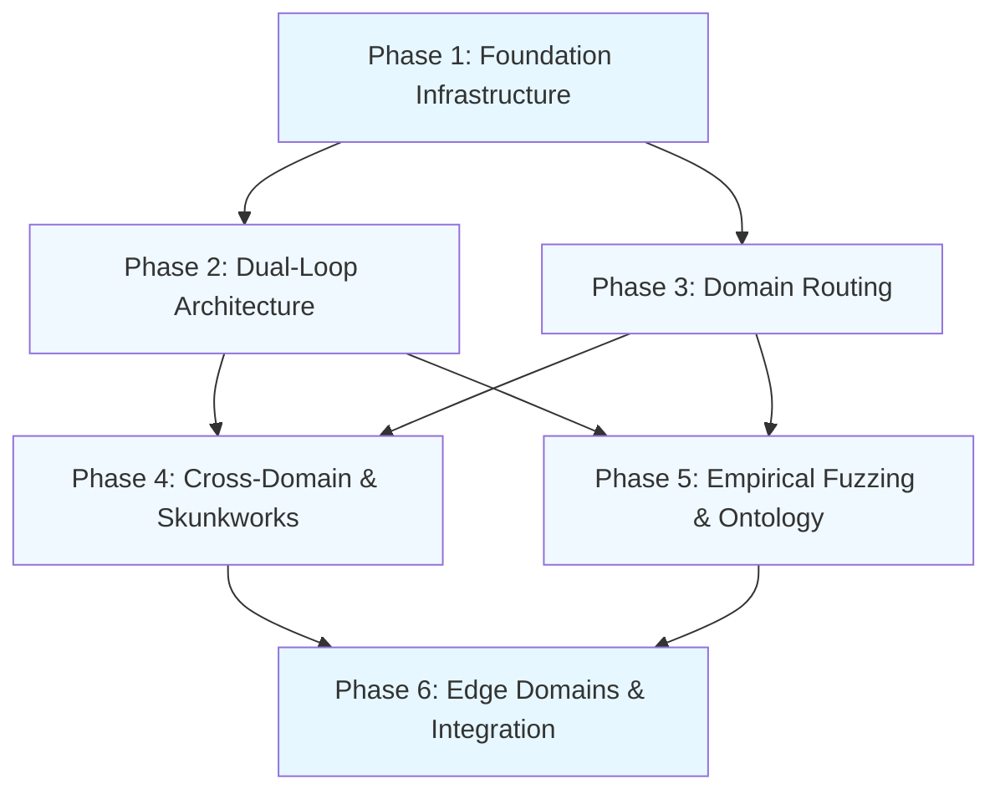

# Phased Implementation Roadmap

## Overview

This implementation roadmap breaks down the integration of the Formalization Domain Structure architecture into 6 logical phases. Each phase is independently testable and builds upon the previous phases. The roadmap is designed to minimize disruption to existing functionality while enabling gradual adoption of new capabilities.

## Phase 1: Foundation Infrastructure (Weeks 1-2)

### Objectives
- Establish core infrastructure for new architecture components
- Implement Redux slices for state management
- Create configuration framework
- Set up basic testing infrastructure

### Tasks

#### 1.1 Redux Slices Creation
- Create [`rlm/redux/slices/loop_slice.py`](rlm/redux/slices/loop_slice.py) - Dual-loop state management
- Create [`rlm/redux/slices/domain_slice.py`](rlm/redux/slices/domain_slice.py) - Domain routing state
- Create [`rlm/redux/slices/synthesis_slice.py`](rlm/redux/slices/synthesis_slice.py) - Cross-domain synthesis state
- Create [`rlm/redux/slices/fuzzing_slice.py`](rlm/redux/slices/fuzzing_slice.py) - Fuzzing loop state
- Create [`rlm/redux/slices/skunkworks_slice.py`](rlm/redux/slices/skunkworks_slice.py) - Skunkworks state
- Create [`rlm/redux/slices/ontology_slice.py`](rlm/redux/slices/ontology_slice.py) - Ontology state
- Create [`rlm/redux/slices/edge_slice.py`](rlm/redux/slices/edge_slice.py) - Edge domains state

#### 1.2 Configuration Framework
- Create [`rlm/config/base_config.py`](rlm/config/base_config.py) - Base configuration class
- Create [`rlm/config/config_loader.py`](rlm/config/config_loader.py) - Configuration loader with validation
- Create [`rlm/config/feature_flags.py`](rlm/config/feature_flags.py) - Feature flag management
- Create configuration templates:
  - [`config/dual-loop.yaml`](config/dual-loop.yaml)
  - [`config/domain-routing.yaml`](config/domain-routing.yaml)
  - [`config/cross-domain-synthesis.yaml`](config/cross-domain-synthesis.yaml)
  - [`config/empirical-fuzzing.yaml`](config/empirical-fuzzing.yaml)
  - [`config/skunkworks.yaml`](config/skunkworks.yaml)
  - [`config/universal-ontology.yaml`](config/universal-ontology.yaml)
  - [`config/advanced-edge-domains.yaml`](config/advanced-edge-domains.yaml)

#### 1.3 Testing Infrastructure
- Create [`tests/loops/test_loop_slice.py`](tests/loops/test_loop_slice.py)
- Create [`tests/routing/test_domain_slice.py`](tests/routing/test_domain_slice.py)
- Create [`tests/synthesis/test_synthesis_slice.py`](tests/synthesis/test_synthesis_slice.py)
- Create [`tests/fuzzing/test_fuzzing_slice.py`](tests/fuzzing/test_fuzzing_slice.py)
- Create [`tests/skunkworks/test_skunkworks_slice.py`](tests/skunkworks/test_skunkworks_slice.py)
- Create [`tests/ontology/test_ontology_slice.py`](tests/ontology/test_ontology_slice.py)
- Create [`tests/edge/test_edge_slice.py`](tests/edge/test_edge_slice.py)

#### 1.4 Core RLM Integration Points
- Modify [`rlm/core/rlm.py`](rlm/core/rlm.py) to add new configuration parameters
- Modify [`rlm/core/types.py`](rlm/core/types.py) to add new type definitions
- Update [`rlm/__init__.py`](rlm/__init__.py) to export new modules

### Dependencies
- None (foundation phase)

### Complexity
- **Low** - Infrastructure and configuration work
- **Risk** - **Low** - No changes to existing functionality

### Testing Strategy
- Unit tests for all Redux slices
- Configuration validation tests
- Type checking with mypy

### Success Criteria
- All Redux slices pass unit tests
- Configuration files load and validate correctly
- RLM class accepts new configuration parameters without breaking existing code
- Feature flags work as expected

---

## Phase 2: Dual-Loop Architecture (Weeks 3-5)

### Objectives
- Implement Fast Loop (System 1) for rapid generation
- Implement Slow Loop (System 2) for formal verification
- Implement Async Message Queue for inter-loop communication
- Implement Bounce-Back Interrupt Protocol

### Tasks

#### 2.1 Fast Loop Implementation
- Create [`rlm/loops/fast_loop.py`](rlm/loops/fast_loop.py)
  - FastLoop class with process_task() method
  - Agent coordination (Architect, Draftsman, Research)
  - UI streaming support
  - Release Candidate packaging
- Create [`rlm/loops/release_candidate.py`](rlm/loops/release_candidate.py)
  - ReleaseCandidate dataclass
  - CandidateStatus enum
  - Serialization methods

#### 2.2 Slow Loop Implementation
- Create [`rlm/loops/slow_loop.py`](rlm/loops/slow_loop.py)
  - SlowLoop class with verify_candidate() method
  - Agent coordination (Autoformalization, Verifier)
  - Proof generation
  - Certification logic
- Extend [`rlm/agents/verification_agent_factory.py`](rlm/agents/verification_agent_factory.py)
  - Add create_slow_loop_agent() method
  - Add create_fast_loop_agent() method

#### 2.3 Async Message Queue
- Create [`rlm/loops/message_queue.py`](rlm/loops/message_queue.py)
  - AsyncMessageQueue class
  - Priority-based queue
  - Persistence support
  - Thread-safe operations

#### 2.4 Bounce-Back Interrupt Protocol
- Create [`rlm/loops/interrupt_protocol.py`](rlm/loops/interrupt_protocol.py)
  - InterruptProtocol class
  - Error translation from Lean to plain text
  - Interrupt dispatching
  - Handler registration

#### 2.5 Loop Manager
- Create [`rlm/loops/loop_manager.py`](rlm/loops/loop_manager.py)
  - LoopManager class coordinating both loops
  - Lifecycle management
  - Error handling
  - Metrics collection

#### 2.6 RLM Integration
- Modify [`rlm/core/rlm.py`](rlm/core/rlm.py)
  - Add loop_manager parameter
  - Integrate loop manager into completion() method
  - Add loop-specific callbacks

#### 2.7 Testing
- Create [`tests/loops/test_fast_loop.py`](tests/loops/test_fast_loop.py)
- Create [`tests/loops/test_slow_loop.py`](tests/loops/test_slow_loop.py)
- Create [`tests/loops/test_message_queue.py`](tests/loops/test_message_queue.py)
- Create [`tests/loops/test_interrupt_protocol.py`](tests/loops/test_interrupt_protocol.py)
- Create [`tests/loops/test_loop_manager.py`](tests/loops/test_loop_manager.py)
- Create [`tests/integration/test_dual_loop.py`](tests/integration/test_dual_loop.py)

### Dependencies
- Phase 1 (Foundation Infrastructure)

### Complexity
- **Medium** - Requires coordination between multiple components
- **Risk** - **Medium** - Changes to core RLM execution flow

### Testing Strategy
- Unit tests for each component
- Integration tests for loop coordination
- End-to-end tests with sample tasks
- Performance tests for message queue

### Success Criteria
- Fast Loop generates Release Candidates
- Slow Loop verifies candidates correctly
- Message queue handles concurrent operations
- Bounce-back interrupts work as expected
- Both loops can run concurrently
- Existing RLM functionality unaffected when dual-loop disabled

---

## Phase 3: Domain Routing & Dynamic Layer 1 (Weeks 6-8)

### Objectives
- Implement domain classification for tasks
- Implement dynamic Layer 1 library loading
- Implement domain-specific research source routing
- Extend existing routing infrastructure

### Tasks

#### 3.1 Domain Classification
- Create [`rlm/routing/domain_classifier.py`](rlm/routing/domain_classifier.py)
  - DomainClassifier class
  - Keyword-based classification
  - Confidence scoring
  - Domain enum (MATH, PHYSICS, SOFTWARE, CHEMISTRY, FINANCE, GENERAL)

#### 3.2 Domain Router
- Create [`rlm/routing/domain_router.py`](rlm/routing/domain_router.py)
  - DomainRouter class
  - Route to domain-specific configurations
  - Domain config management
- Create [`rlm/routing/domain_config.py`](rlm/routing/domain_config.py)
  - DomainConfig dataclass
  - Domain metadata

#### 3.3 Dynamic Layer 1 Loading
- Create [`rlm/layer1/dynamic_loader.py`](rlm/layer1/dynamic_loader.py)
  - DynamicLayer1Loader class
  - Bootstrap file generation
  - Library loading/unloading
  - Cache management
- Extend [`rlm/environments/layer1_bootstrap.py`](rlm/environments/layer1_bootstrap.py)
  - Add dynamic loading methods
  - Add library management

#### 3.4 Domain Research Sources
- Create [`rlm/research/domain_sources.py`](rlm/research/domain_sources.py)
  - DomainResearchSources class
  - Source validation
  - Query routing

#### 3.5 Domain Metadata
- Create [`rlm/routing/domain_metadata.py`](rlm/routing/domain_metadata.py)
  - DomainMetadata class
  - Constraint extraction
  - Theorem extraction

#### 3.6 Integration with Existing Routing
- Modify [`rlm/routing/backend_router.py`](rlm/routing/backend_router.py)
  - Add domain-based routing rules
- Modify [`rlm/routing/task_descriptor.py`](rlm/routing/task_descriptor.py)
  - Add domain classification
  - Add domain metadata

#### 3.7 Testing
- Create [`tests/routing/test_domain_classifier.py`](tests/routing/test_domain_classifier.py)
- Create [`tests/routing/test_domain_router.py`](tests/routing/test_domain_router.py)
- Create [`tests/layer1/test_dynamic_loader.py`](tests/layer1/test_dynamic_loader.py)
- Create [`tests/research/test_domain_sources.py`](tests/research/test_domain_sources.py)
- Create [`tests/integration/test_domain_routing.py`](tests/integration/test_domain_routing.py)

### Dependencies
- Phase 1 (Foundation Infrastructure)
- Phase 2 (Dual-Loop Architecture) - for verification

### Complexity
- **Medium** - Extends existing routing infrastructure
- **Risk** - **Low-Medium** - Non-disruptive design with feature flags

### Testing Strategy
- Unit tests for each component
- Integration tests with existing routing
- Domain classification accuracy tests
- Layer 1 loading/unloading tests

### Success Criteria
- Tasks are correctly classified into domains
- Domain-specific libraries load dynamically
- Research sources route correctly
- Existing routing functionality unaffected when domain routing disabled

---

## Phase 4: Cross-Domain Synthesis & Skunkworks (Weeks 9-12)

### Objectives
- Implement cross-domain synthesis engine
- Implement matrix engine for domain combination
- Implement Skunkworks protocol
- Implement discovery and justification phases

### Tasks

#### 4.1 Cross-Domain Synthesis Engine
- Create [`rlm/synthesis/cross_domain_engine.py`](rlm/synthesis/cross_domain_engine.py)
  - CrossDomainSynthesisEngine class
  - Domain combination logic
  - Unified structure creation

#### 4.2 Matrix Engine
- Create [`rlm/synthesis/matrix_engine.py`](rlm/synthesis/matrix_engine.py)
  - MatrixEngine class
  - Matrix operations
  - Constraint extraction

#### 4.3 Domain Structure
- Create [`rlm/synthesis/domain_structure.py`](rlm/synthesis/domain_structure.py)
  - DomainStructure class
  - Unified structure representation
  - Translation rules

#### 4.4 Synthesis Translator
- Create [`rlm/synthesis/synthesis_translator.py`](rlm/synthesis/synthesis_translator.py)
  - SynthesisTranslator class
  - Type mappings
  - Constraint translation

#### 4.5 Genesis Prover
- Create [`rlm/synthesis/genesis_prover.py`](rlm/synthesis/genesis_prover.py)
  - GenesisProver class
  - Genesis state proving
  - Invariant preservation

#### 4.6 Skunkworks Protocol
- Create [`rlm/skunkworks/skunkworks_protocol.py`](rlm/skunkworks/skunkworks_protocol.py)
  - SkunkworksProtocol class
  - Discovery and justification coordination

#### 4.7 Discovery Phase
- Create [`rlm/skunkworks/discovery_phase.py`](rlm/skunkworks/discovery_phase.py)
  - DiscoveryPhase class
  - Exploration logic
  - Hypothesis generation

#### 4.8 Justification Phase
- Create [`rlm/skunkworks/justification_phase.py`](rlm/skunkworks/justification_phase.py)
  - JustificationPhase class
  - Formalization
  - Verification

#### 4.9 Hypothesis Manager
- Create [`rlm/skunkworks/hypothesis_manager.py`](rlm/skunkworks/hypothesis_manager.py)
  - HypothesisManager class
  - Hypothesis tracking
  - Evolution history

#### 4.10 Skunkworks Environment
- Create [`rlm/skunkworks/skunkworks_environment.py`](rlm/skunkworks/skunkworks_environment.py)
  - SkunkworksEnvironment class
  - Isolated environment
  - Internet access

#### 4.11 Translation Engine
- Create [`rlm/skunkworks/translation_engine.py`](rlm/skunkworks/translation_engine.py)
  - TranslationEngine class
  - Discovery to formal translation

#### 4.12 Testing
- Create [`tests/synthesis/test_cross_domain_engine.py`](tests/synthesis/test_cross_domain_engine.py)
- Create [`tests/synthesis/test_matrix_engine.py`](tests/synthesis/test_matrix_engine.py)
- Create [`tests/synthesis/test_domain_structure.py`](tests/synthesis/test_domain_structure.py)
- Create [`tests/synthesis/test_synthesis_translator.py`](tests/synthesis/test_synthesis_translator.py)
- Create [`tests/synthesis/test_genesis_prover.py`](tests/synthesis/test_genesis_prover.py)
- Create [`tests/skunkworks/test_skunkworks_protocol.py`](tests/skunkworks/test_skunkworks_protocol.py)
- Create [`tests/skunkworks/test_discovery_phase.py`](tests/skunkworks/test_discovery_phase.py)
- Create [`tests/skunkworks/test_justification_phase.py`](tests/skunkworks/test_justification_phase.py)
- Create [`tests/integration/test_cross_domain_synthesis.py`](tests/integration/test_cross_domain_synthesis.py)
- Create [`tests/integration/test_skunkworks.py`](tests/integration/test_skunkworks.py)

### Dependencies
- Phase 1 (Foundation Infrastructure)
- Phase 2 (Dual-Loop Architecture)
- Phase 3 (Domain Routing & Dynamic Layer 1)

### Complexity
- **High** - Complex multi-domain interactions
- **Risk** - **Medium** - Well-contained within synthesis and skunkworks modules

### Testing Strategy
- Unit tests for each component
- Integration tests for cross-domain operations
- End-to-end tests with multi-domain tasks
- Synthesis correctness tests
- Skunkworks workflow tests

### Success Criteria
- Multiple domains combine correctly
- Unified structures are consistent
- Genesis proofs succeed
- Skunkworks discovery works
- Justification phase verifies hypotheses
- Existing functionality unaffected

---

## Phase 5: Empirical Fuzzing & Universal Ontology (Weeks 13-16)

### Objectives
- Implement empirical fuzzing loop with automata learning
- Implement black-box sandbox for isolated testing
- Implement universal ontology bootstrapping for novel domains
- Implement naked axiom ban enforcement

### Tasks

#### 5.1 Empirical Fuzzing Loop
- Create [`rlm/fuzzing/empirical_loop.py`](rlm/fuzzing/empirical_loop.py)
  - EmpiricalFuzzingLoop class
  - Protocol discovery
  - Fuzzing campaigns

#### 5.2 Black-Box Sandbox
- Create [`rlm/fuzzing/black_box_sandbox.py`](rlm/fuzzing/black_box_sandbox.py)
  - BlackBoxSandbox class
  - Isolated environment
  - Execution monitoring

#### 5.3 Automata Learner
- Create [`rlm/fuzzing/automata_learner.py`](rlm/fuzzing/automata_learner.py)
  - AutomataLearner class
  - Angluin's L* algorithm
  - Hypothesis refinement

#### 5.4 FSM Generator
- Create [`rlm/fuzzing/fsm_generator.py`](rlm/fuzzing/fsm_generator.py)
  - FSMGenerator class
  - Lean FSM generation
  - Haskell FSM generation
  - Property proving

#### 5.5 Probing Agent
- Create [`rlm/fuzzing/probing_agent.py`](rlm/fuzzing/probing_agent.py)
  - ProbingAgent class
  - Probe design
  - Result analysis

#### 5.6 Universal Ontology Bootstrapping
- Create [`rlm/ontology/universal_ontology.py`](rlm/ontology/universal_ontology.py)
  - UniversalOntologyBootstrapping class
  - Novel domain handling

#### 5.7 Domain Zero
- Create [`rlm/ontology/domain_zero.py`](rlm/ontology/domain_zero.py)
  - DomainZero class
  - Structure generation
  - Genesis proving

#### 5.8 Structure Generator
- Create [`rlm/ontology/structure_generator.py`](rlm/ontology/structure_generator.py)
  - StructureGenerator class
  - Type extraction
  - Invariant generation

#### 5.9 Ontology Genesis Prover
- Create [`rlm/ontology/genesis_prover.py`](rlm/ontology/genesis_prover.py)
  - OntologyGenesisProver class
  - Inhabitation proofs
  - Invariant preservation

#### 5.10 Naked Axiom Ban
- Create [`rlm/ontology/naked_axiom_ban.py`](rlm/ontology/naked_axiom_ban.py)
  - NakedAxiomBan class
  - Axiom usage checking
  - Override validation

#### 5.11 Environment Router Integration
- Modify [`rlm/routing/environment_router.py`](rlm/routing/environment_router.py)
  - Add fuzzing environment routing
  - Add skunkworks environment routing

#### 5.12 Testing
- Create [`tests/fuzzing/test_empirical_loop.py`](tests/fuzzing/test_empirical_loop.py)
- Create [`tests/fuzzing/test_black_box_sandbox.py`](tests/fuzzing/test_black_box_sandbox.py)
- Create [`tests/fuzzing/test_automata_learner.py`](tests/fuzzing/test_automata_learner.py)
- Create [`tests/fuzzing/test_fsm_generator.py`](tests/fuzzing/test_fsm_generator.py)
- Create [`tests/fuzzing/test_probing_agent.py`](tests/fuzzing/test_probing_agent.py)
- Create [`tests/ontology/test_universal_ontology.py`](tests/ontology/test_universal_ontology.py)
- Create [`tests/ontology/test_domain_zero.py`](tests/ontology/test_domain_zero.py)
- Create [`tests/ontology/test_structure_generator.py`](tests/ontology/test_structure_generator.py)
- Create [`tests/ontology/test_genesis_prover.py`](tests/ontology/test_genesis_prover.py)
- Create [`tests/ontology/test_naked_axiom_ban.py`](tests/ontology/test_naked_axiom_ban.py)
- Create [`tests/integration/test_empirical_fuzzing.py`](tests/integration/test_empirical_fuzzing.py)
- Create [`tests/integration/test_universal_ontology.py`](tests/integration/test_universal_ontology.py)

### Dependencies
- Phase 1 (Foundation Infrastructure)
- Phase 2 (Dual-Loop Architecture)
- Phase 3 (Domain Routing & Dynamic Layer 1)

### Complexity
- **High** - Complex algorithms (automata learning) and novel domain handling
- **Risk** - **Medium-High** - Sandbox isolation and novel domain handling

### Testing Strategy
- Unit tests for each component
- Integration tests for fuzzing workflows
- End-to-end tests with unknown systems
- Automata learning correctness tests
- Ontology consistency tests

### Success Criteria
- Automata learning discovers correct FSMs
- Sandbox isolation is effective
- Novel domains can be bootstrapped
- Naked axiom ban is enforced
- Genesis proofs succeed for novel domains
- Existing functionality unaffected

---

## Phase 6: Advanced Edge Domains & Final Integration (Weeks 17-20)

### Objectives
- Implement advanced edge domains (cybersecurity, reverse engineering)
- Implement user-defined axiomatic overrides
- Implement hardware discovery
- Final integration and testing

### Tasks

#### 6.1 Advanced Edge Domains
- Create [`rlm/edge/advanced_edge_domains.py`](rlm/edge/advanced_edge_domains.py)
  - AdvancedEdgeDomains class
  - Edge task processing

#### 6.2 User Overrides
- Create [`rlm/edge/user_overrides.py`](rlm/edge/user_overrides.py)
  - UserOverrides class
  - Override parsing
  - Lean code generation

#### 6.3 Edge Layer
- Create [`rlm/edge/edge_layer.py`](rlm/edge/edge_layer.py)
  - EdgeLayer class
  - Edge environment creation
  - Tool configuration

#### 6.4 Cybersecurity Tools
- Create [`rlm/edge/cybersec_tools.py`](rlm/edge/cybersec_tools.py)
  - CybersecurityTools class
  - Security environments
  - Vulnerability analysis

#### 6.5 Reverse Engineering
- Create [`rlm/edge/reverse_engineering.py`](rlm/edge/reverse_engineering.py)
  - ReverseEngineering class
  - Binary analysis
  - Protocol analysis

#### 6.6 Hardware Discovery
- Create [`rlm/edge/hardware_discovery.py`](rlm/edge/hardware_discovery.py)
  - HardwareDiscovery class
  - Protocol discovery
  - Driver generation

#### 6.7 Redux Middleware Integration
- Extend [`rlm/redux/middleware/verification_middleware.py`](rlm/redux/middleware/verification_middleware.py)
  - Add interrupt protocol handling
  - Add synthesis validation
  - Add ontology validation

#### 6.8 Environment Factory Integration
- Extend [`rlm/environments/environment_factory.py`](rlm/environments/environment_factory.py)
  - Add fuzzing environment creation
  - Add skunkworks environment creation
  - Add edge environment creation

#### 6.9 Final RLM Integration
- Complete [`rlm/core/rlm.py`](rlm/core/rlm.py) modifications
  - All configuration parameters
  - All integration points
  - Backward compatibility

#### 6.10 Documentation
- Update [`README.md`](README.md) with new features
- Create user guides for each component
- Create API documentation
- Create deployment guides

#### 6.11 Testing
- Create [`tests/edge/test_advanced_edge_domains.py`](tests/edge/test_advanced_edge_domains.py)
- Create [`tests/edge/test_user_overrides.py`](tests/edge/test_user_overrides.py)
- Create [`tests/edge/test_edge_layer.py`](tests/edge/test_edge_layer.py)
- Create [`tests/edge/test_cybersec_tools.py`](tests/edge/test_cybersec_tools.py)
- Create [`tests/edge/test_reverse_engineering.py`](tests/edge/test_reverse_engineering.py)
- Create [`tests/edge/test_hardware_discovery.py`](tests/edge/test_hardware_discovery.py)
- Create [`tests/integration/test_edge_domains.py`](tests/integration/test_edge_domains.py)
- Create [`tests/integration/test_full_system.py`](tests/integration/test_full_system.py)
- Create [`tests/regression/test_backward_compatibility.py`](tests/regression/test_backward_compatibility.py)

### Dependencies
- All previous phases (1-5)

### Complexity
- **Medium-High** - Multiple specialized domains
- **Risk** - **Medium** - Well-contained within edge module

### Testing Strategy
- Unit tests for each component
- Integration tests for edge workflows
- End-to-end tests with edge tasks
- Security tests for cybersec tools
- Backward compatibility tests
- Performance tests

### Success Criteria
- Edge domains work correctly
- User overrides are applied safely
- Hardware discovery succeeds
- All components integrate seamlessly
- Backward compatibility maintained
- Documentation is complete
- All tests pass

---

## Phase Dependencies Diagram

## Risk Summary by Phase

| Phase | Complexity | Risk | Primary Risks |
|-------|-----------|-------|---------------|
| 1 | Low | Low | Configuration errors |
| 2 | Medium | Medium | Core execution flow changes |
| 3 | Medium | Low-Medium | Domain classification errors |
| 4 | High | Medium | Multi-domain consistency |
| 5 | High | Medium-High | Sandbox isolation, novel domains |
| 6 | Medium-High | Medium | Edge domain integration |

## Rollback Strategy

Each phase includes a rollback strategy:
- **Phase 1-3**: Feature flags allow immediate rollback
- **Phase 4-5**: Component isolation allows selective rollback
- **Phase 6**: Final integration with comprehensive testing before release

## Success Metrics

- All unit tests pass
- All integration tests pass
- Backward compatibility maintained
- Performance within acceptable bounds
- Documentation complete
- Feature flags work correctly