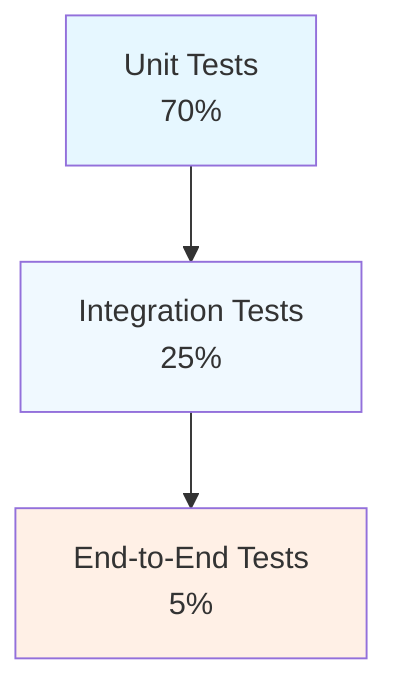
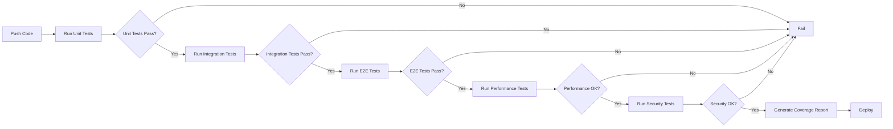

# Testing Strategy

## Overview

This document defines a comprehensive testing strategy for the Formalization Domain Structure integration. The strategy covers unit testing, integration testing, end-to-end testing, performance testing, and security testing for all new components.

## Testing Principles

1. **Test-Driven Development**: Write tests before or alongside implementation
2. **Comprehensive Coverage**: Aim for high code coverage across all components
3. **Fast Feedback**: Keep unit tests fast, integration tests reasonable
4. **Isolation**: Tests should be independent and isolated
5. **Reproducibility**: Tests should produce consistent results
6. **Maintainability**: Tests should be easy to understand and modify

---

## Testing Pyramid



---

## Unit Testing

### Scope

Unit tests focus on individual components in isolation:
- Individual classes and functions
- Redux slices and reducers
- Configuration validation
- Data structures and models

### Frameworks

- **pytest**: Primary testing framework
- **pytest-asyncio**: For async components
- **pytest-mock**: For mocking dependencies
- **unittest.mock**: For Python standard library mocking

### Unit Test Structure

```python
# Example test structure
import pytest
from unittest.mock import Mock, patch

class TestFastLoop:
    @pytest.fixture
    def fast_loop(self):
        from rlm.loops.fast_loop import FastLoop
        return FastLoop(config={})
    
    def test_process_task_returns_release_candidate(self, fast_loop):
        # Arrange
        task = MockTask()
        
        # Act
        result = fast_loop.process_task(task)
        
        # Assert
        assert isinstance(result, ReleaseCandidate)
        assert result.status == CandidateStatus.PENDING
    
    def test_handle_interrupt_stops_processing(self, fast_loop):
        # Arrange
        interrupt = MockInterrupt()
        
        # Act
        fast_loop.handle_interrupt(interrupt)
        
        # Assert
        assert fast_loop.is_paused
```

### Coverage Requirements

- **Minimum Coverage**: 80% for all new code
- **Critical Path Coverage**: 90% for critical components (loops, routing)
- **Branch Coverage**: 70% minimum

### Unit Test Categories

#### 1. Redux Slices

**Test File**: `tests/redux/slices/test_{slice_name}.py`

**Test Cases**:
- Initial state creation
- Action handling
- State updates
- Edge cases
- Invalid inputs

**Example**:
```python
def test_loop_slice_initial_state():
    state = LoopState()
    assert state.fast_loop_active == False
    assert state.slow_loop_active == False

def test_loop_slice_handles_start_action():
    state = LoopState()
    action = LoopActions.start_fast_loop()
    new_state = loop_reducer(state, action)
    assert new_state.fast_loop_active == True
```

#### 2. Configuration

**Test File**: `tests/config/test_{component}_config.py`

**Test Cases**:
- Valid configuration loading
- Invalid configuration rejection
- Default configuration
- Configuration merging
- Feature flag parsing

**Example**:
```python
def test_load_valid_dual_loop_config():
    config = load_config("config/dual-loop.yaml")
    assert config["fast_loop"]["enabled"] == True
    assert config["slow_loop"]["max_concurrent"] == 3

def test_invalid_config_raises_error():
    with pytest.raises(ConfigValidationError):
        load_config("config/invalid.yaml")
```

#### 3. Domain Classification

**Test File**: `tests/routing/test_domain_classifier.py`

**Test Cases**:
- Correct domain classification
- Confidence scoring
- Keyword extraction
- Edge cases (ambiguous tasks)
- Fallback to default domain

**Example**:
```python
def test_classify_math_task():
    classifier = DomainClassifier()
    domain = classifier.classify("Prove the Pythagorean theorem")
    assert domain == Domain.MATH
    assert classifier.get_confidence("Prove the Pythagorean theorem", Domain.MATH) > 0.8
```

#### 4. Message Queue

**Test File**: `tests/loops/test_message_queue.py`

**Test Cases**:
- Enqueue and dequeue
- Priority ordering
- Thread safety
- Persistence
- Queue limits
- Empty queue handling

**Example**:
```python
def test_enqueue_dequeue():
    queue = AsyncMessageQueue(max_size=10)
    candidate = ReleaseCandidate(id="test", task_id="task1")
    queue.enqueue(candidate)
    result = queue.dequeue()
    assert result.id == "test"

def test_priority_ordering():
    queue = AsyncMessageQueue(max_size=10)
    queue.enqueue(ReleaseCandidate(id="low", priority="low"))
    queue.enqueue(ReleaseCandidate(id="high", priority="high"))
    result = queue.dequeue()
    assert result.id == "high"
```

---

## Integration Testing

### Scope

Integration tests focus on interactions between components:
- Component integration
- API integration
- Database integration
- External service integration

### Frameworks

- **pytest**: Primary testing framework
- **pytest-docker**: For container-based integration tests
- **requests-mock**: For mocking HTTP requests
- **faker**: For generating test data

### Integration Test Categories

#### 1. Dual-Loop Integration

**Test File**: `tests/integration/test_dual_loop.py`

**Test Cases**:
- Fast loop and slow loop coordination
- Message queue integration
- Bounce-back interrupt handling
- Concurrent operation
- Error handling and recovery

**Example**:
```python
def test_fast_slow_loop_coordination():
    loop_manager = LoopManager(config=dual_loop_config)
    task = MockTask()
    
    # Start both loops
    loop_manager.start()
    
    # Submit task
    result = loop_manager.process_task(task)
    
    # Verify coordination
    assert result.status == TaskStatus.COMPLETED
    assert loop_manager.message_queue.is_empty()
    
    loop_manager.stop()
```

#### 2. Domain Routing Integration

**Test File**: `tests/integration/test_domain_routing.py`

**Test Cases**:
- Task classification to domain routing
- Dynamic Layer 1 loading
- Research source routing
- Domain fallback
- Multi-domain task handling

**Example**:
```python
def test_task_classification_to_domain_routing():
    router = DomainRouter(config=domain_config)
    task = TaskDescriptor(prompt="Design a physics simulation")
    
    # Classify and route
    domain = router.classify_domain(task.prompt)
    routed_task = router.route_to_domain(task, domain)
    
    # Verify routing
    assert domain == Domain.PHYSICS
    assert routed_task.layer1_imports == ["SciLean", "PhysLib"]
```

#### 3. Cross-Domain Synthesis Integration

**Test File**: `tests/integration/test_cross_domain_synthesis.py`

**Test Cases**:
- Multi-domain task processing
- Unified structure creation
- Genesis proof generation
- Synthesis validation
- Error handling

**Example**:
```python
def test_multi_domain_synthesis():
    engine = CrossDomainSynthesisEngine(config=synthesis_config)
    domains = [Domain.PHYSICS, Domain.FINANCE]
    
    # Combine domains
    unified = engine.combine_domains(domains)
    
    # Verify synthesis
    assert unified is not None
    assert engine.validate_structure_consistency(unified) == True
```

#### 4. Empirical Fuzzing Integration

**Test File**: `tests/integration/test_empirical_fuzzing.py`

**Test Cases**:
- Sandbox creation and isolation
- Automata learning workflow
- FSM generation and validation
- Probe execution
- Fuzzing campaign completion

**Example**:
```python
def test_fuzzing_workflow():
    loop = EmpiricalFuzzingLoop(config=fuzzing_config)
    target = MockTargetSystem()
    
    # Discover protocol
    protocol = loop.discover_protocol(target)
    
    # Verify discovery
    assert protocol is not None
    assert protocol.fsm is not None
    assert loop.validate_discovery(protocol) == True
```

#### 5. Skunkworks Integration

**Test File**: `tests/integration/test_skunkworks.py`

**Test Cases**:
- Discovery phase execution
- Justification phase execution
- Hypothesis translation
- Environment isolation
- Full workflow

**Example**:
```python
def test_skunkworks_workflow():
    protocol = SkunkworksProtocol(config=skunkworks_config)
    task = TaskDescriptor(prompt="Reverse engineer this API")
    
    # Execute full workflow
    result = protocol.execute_skunkworks_task(task)
    
    # Verify workflow
    assert result.status == TaskStatus.COMPLETED
    assert result.hypothesis is not None
    assert result.verification == VerificationResult.PASSED
```

#### 6. Environment Routing Integration

**Test File**: `tests/integration/test_environment_routing.py`

**Test Cases**:
- Environment selection based on task
- Environment creation and cleanup
- Environment isolation
- Resource limits
- Error handling

**Example**:
```python
def test_environment_routing():
    router = EnvironmentRouter(config=environment_config)
    task = TaskDescriptor(capsabilities={"needs_docker_isolation": True})
    
    # Route to environment
    route = router.choose_env(task.to_dict())
    
    # Verify routing
    assert route.environment_id == "docker"
    env = router.create_environment(route.environment_id)
    assert env is not None
    env.cleanup()
```

---

## End-to-End Testing

### Scope

End-to-end tests focus on complete user workflows:
- Complete task execution
- Multi-component interactions
- User-facing features
- Real-world scenarios

### Frameworks

- **pytest**: Primary testing framework
- **playwright**: For UI testing (if applicable)
- **selenium**: Alternative for UI testing

### End-to-End Test Scenarios

#### Scenario 1: Single-Domain Task with Verification

**Test File**: `tests/e2e/test_single_domain_task.py`

**Description**: Process a single-domain task through the complete pipeline

**Steps**:
1. Submit single-domain task (e.g., physics simulation)
2. Verify domain classification
3. Verify Layer 1 loading
4. Verify task processing
5. Verify output correctness

**Example**:
```python
def test_single_domain_physics_task():
    rlm = RLM(
        backend="openai",
        environment="local",
        dual_loop_config="config/dual-loop.yaml",
        domain_config="config/domain-routing.yaml"
    )
    
    result = rlm.completion("Design a simple pendulum simulation")
    
    assert result.status == "completed"
    assert "pendulum" in result.content.lower()
```

#### Scenario 2: Multi-Domain Task with Synthesis

**Test File**: `tests/e2e/test_multi_domain_task.py`

**Description**: Process a multi-domain task requiring synthesis

**Steps**:
1. Submit multi-domain task (e.g., algorithmic trading bot)
2. Verify domain classification
3. Verify cross-domain synthesis
4. Verify unified structure creation
5. Verify genesis proof
6. Verify output correctness

**Example**:
```python
def test_multi_domain_trading_bot():
    rlm = RLM(
        backend="openai",
        environment="local",
        synthesis_config="config/cross-domain-synthesis.yaml"
    )
    
    result = rlm.completion(
        "Design an algorithmic trading bot for oil shipments"
    )
    
    assert result.status == "completed"
    assert "trading" in result.content.lower()
    assert result.synthesis_verified == True
```

#### Scenario 3: Unknown Domain with Ontology Bootstrapping

**Test File**: `tests/e2e/test_unknown_domain_task.py`

**Description**: Process a task for an unknown domain requiring ontology bootstrapping

**Steps**:
1. Submit unknown domain task (e.g., custom game rules)
2. Verify Domain Zero routing
3. Verify ontology generation
4. Verify genesis proof
5. Verify task processing
6. Verify output correctness

**Example**:
```python
def test_unknown_domain_game():
    rlm = RLM(
        backend="openai",
        environment="local",
        ontology_config="config/universal-ontology.yaml"
    )
    
    result = rlm.completion(
        "Create a simple city-building game with resource management"
    )
    
    assert result.status == "completed"
    assert result.ontology_bootstrapped == True
```

#### Scenario 4: Empirical Discovery with Fuzzing

**Test File**: `tests/e2e/test_empirical_discovery.py`

**Description**: Discover and verify an unknown protocol

**Steps**:
1. Submit protocol discovery task
2. Verify fuzzing loop execution
3. Verify FSM generation
4. Verify proof generation
5. Verify driver generation

**Example**:
```python
def test_empirical_protocol_discovery():
    rlm = RLM(
        backend="openai",
        environment="docker",
        fuzzing_config="config/empirical-fuzzing.yaml"
    )
    
    result = rlm.completion(
        "Discover the protocol for this undocumented IoT device"
    )
    
    assert result.status == "completed"
    assert result.protocol_discovered == True
    assert result.fsm_generated == True
```

#### Scenario 5: Skunkworks Workflow

**Test File**: `tests/e2e/test_skunkworks_workflow.py`

**Description**: Execute a skunkworks workflow with discovery and justification

**Steps**:
1. Submit skunkworks task
2. Verify discovery phase execution
3. Verify hypothesis generation
4. Verify justification phase execution
5. Verify formalization
6. Verify verification

**Example**:
```python
def test_skunkworks_reverse_engineering():
    rlm = RLM(
        backend="openai",
        environment="docker",
        skunkworks_config="config/skunkworks.yaml"
    )
    
    result = rlm.completion(
        "Figure out how this undocumented API works"
    )
    
    assert result.status == "completed"
    assert result.discovery_completed == True
    assert result.verification_passed == True
```

---

## Performance Testing

### Scope

Performance tests focus on system performance under load:
- Response times
- Throughput
- Resource utilization
- Scalability

### Frameworks

- **locust**: Load testing
- **pytest-benchmark**: Microbenchmarking
- **memory_profiler**: Memory profiling
- **cProfile**: CPU profiling

### Performance Test Categories

#### 1. Dual-Loop Performance

**Test File**: `tests/performance/test_dual_loop_performance.py`

**Metrics**:
- Message queue throughput
- Loop coordination overhead
- Interrupt handling latency
- Resource utilization

**Example**:
```python
def test_message_queue_throughput():
    queue = AsyncMessageQueue(max_size=1000)
    
    start_time = time.time()
    for i in range(1000):
        queue.enqueue(ReleaseCandidate(id=str(i)))
    enqueue_time = time.time() - start_time
    
    assert enqueue_time < 1.0  # Should enqueue 1000 items in < 1 second
```

#### 2. Domain Routing Performance

**Test File**: `tests/performance/test_domain_routing_performance.py`

**Metrics**:
- Classification latency
- Routing decision time
- Layer 1 loading time

**Example**:
```python
def test_domain_classification_latency():
    classifier = DomainClassifier()
    
    start_time = time.time()
    for i in range(100):
        classifier.classify("Test prompt for classification")
    classification_time = time.time() - start_time
    
    avg_time = classification_time / 100
    assert avg_time < 0.01  # Should classify in < 10ms average
```

#### 3. Synthesis Performance

**Test File**: `tests/performance/test_synthesis_performance.py`

**Metrics**:
- Multi-domain synthesis time
- Matrix operation time
- Genesis proof time

**Example**:
```python
def test_cross_domain_synthesis_time():
    engine = CrossDomainSynthesisEngine(config=synthesis_config)
    domains = [Domain.PHYSICS, Domain.FINANCE, Domain.SOFTWARE]
    
    start_time = time.time()
    unified = engine.combine_domains(domains)
    synthesis_time = time.time() - start_time
    
    assert synthesis_time < 5.0  # Should synthesize in < 5 seconds
```

#### 4. Load Testing

**Test File**: `tests/performance/test_load.py`

**Scenarios**:
- Concurrent task processing
- High-volume message queue
- Multi-user scenarios

**Example**:
```python
def test_concurrent_task_processing():
    rlm = RLM(
        backend="openai",
        environment="local",
        dual_loop_config="config/dual-loop.yaml"
    )
    
    # Submit 10 concurrent tasks
    with ThreadPoolExecutor(max_workers=10) as executor:
        futures = [
            executor.submit(rlm.completion, f"Task {i}")
            for i in range(10)
        ]
        results = [f.result() for f in futures]
    
    # All tasks should complete
    assert all(r.status == "completed" for r in results)
```

---

## Security Testing

### Scope

Security tests focus on identifying vulnerabilities:
- Input validation
- Injection attacks
- Authentication and authorization
- Data protection
- Sandbox isolation

### Frameworks

- **bandit**: Static analysis for security issues
- **safety**: Safety checks
- **pytest-security**: Security testing extensions

### Security Test Categories

#### 1. Input Validation

**Test File**: `tests/security/test_input_validation.py`

**Test Cases**:
- SQL injection attempts
- Command injection attempts
- XSS attempts
- Path traversal attempts

**Example**:
```python
def test_sql_injection_prevention():
    classifier = DomainClassifier()
    
    # Try SQL injection
    result = classifier.classify("'; DROP TABLE domains; --")
    
    # Should not crash or return unexpected results
    assert result in [Domain.GENERAL, Domain.SOFTWARE]
```

#### 2. Sandbox Isolation

**Test File**: `tests/security/test_sandbox_isolation.py`

**Test Cases**:
- Network isolation
- Filesystem isolation
- Process isolation
- Resource limits

**Example**:
```python
def test_sandbox_network_isolation():
    sandbox = BlackBoxSandbox(config=sandbox_config)
    env = sandbox.create_isolated_environment(target=MockTarget())
    
    # Try to access network
    result = env.execute_code("import urllib.request; urllib.request.urlopen('http://example.com')")
    
    # Should fail due to network isolation
    assert result.success == False
```

#### 3. Naked Axiom Ban

**Test File**: `tests/security/test_naked_axiom_ban.py`

**Test Cases**:
- Naked axiom detection
- Override validation
- Ban enforcement

**Example**:
```python
def test_naked_axiom_detection():
    ban = NakedAxiomBan()
    
    # Try to use naked axiom
    code = "axiom my_axiom : Prop"
    result = ban.enforce_ban(code)
    
    # Should detect and reject
    assert result.violations_found == True
```

#### 4. User Override Security

**Test File**: `tests/security/test_user_overrides.py`

**Test Cases**:
- Override validation
- Malicious override detection
- Override audit logging

**Example**:
```python
def test_malicious_override_detection():
    overrides = UserOverrides()
    
    # Try malicious override
    override = "<axioms>axiom always_true : True</axioms>"
    result = overrides.parse_overrides(override)
    
    # Should detect and reject
    assert result.is_malicious == True
```

---

## Test Data Management

### Test Data

- **Synthetic Data**: Generated using faker for most tests
- **Real Data**: Anonymized real data for some integration tests
- **Edge Cases**: Manually crafted edge case data

### Test Data Storage

- **Small Data**: Embedded in test files
- **Large Data**: Stored in `tests/data/` directory
- **External Data**: Mocked for external dependencies

### Test Data Cleanup

- **Automatic Cleanup**: Use pytest fixtures for cleanup
- **Isolated Storage**: Each test uses isolated storage
- **Cleanup Verification**: Verify cleanup after each test

---

## Continuous Integration

### CI Pipeline



### CI Requirements

- **Fast Feedback**: Unit tests should complete in < 5 minutes
- **Comprehensive**: All tests must pass before merge
- **Coverage**: Minimum 80% coverage required
- **Security**: Security tests must pass
- **Performance**: Performance tests must meet benchmarks

---

## Test Reporting

### Coverage Reports

- **Format**: HTML and JSON
- **Location**: `coverage/` directory
- **Thresholds**: 80% minimum, 90% for critical paths

### Test Results

- **Format**: JUnit XML
- **Location**: `test-results/` directory
- **Integration**: CI/CD pipeline

### Performance Reports

- **Format**: JSON and CSV
- **Location**: `performance/` directory
- **Trends**: Track performance over time

---

## Test Maintenance

### Test Review

- **Regular Review**: Review tests quarterly
- **Update**: Update tests as features change
- **Remove**: Remove obsolete tests
- **Improve**: Improve flaky or slow tests

### Test Documentation

- **Test Documentation**: Document test purpose and expectations
- **Test Examples**: Provide examples for complex tests
- **Test Guidelines**: Follow testing guidelines and best practices

---

## Testing Checklist

### Before Implementation

- [ ] Define test cases for new features
- [ ] Set up test environment
- [ ] Configure test data
- [ ] Set up mocking for external dependencies

### During Implementation

- [ ] Write unit tests alongside code
- [ ] Write integration tests for new integrations
- [ ] Update test documentation
- [ ] Run tests frequently

### After Implementation

- [ ] Run full test suite
- [ ] Verify coverage requirements
- [ ] Run performance tests
- [ ] Run security tests
- [ ] Fix any failing tests
- [ ] Document test results