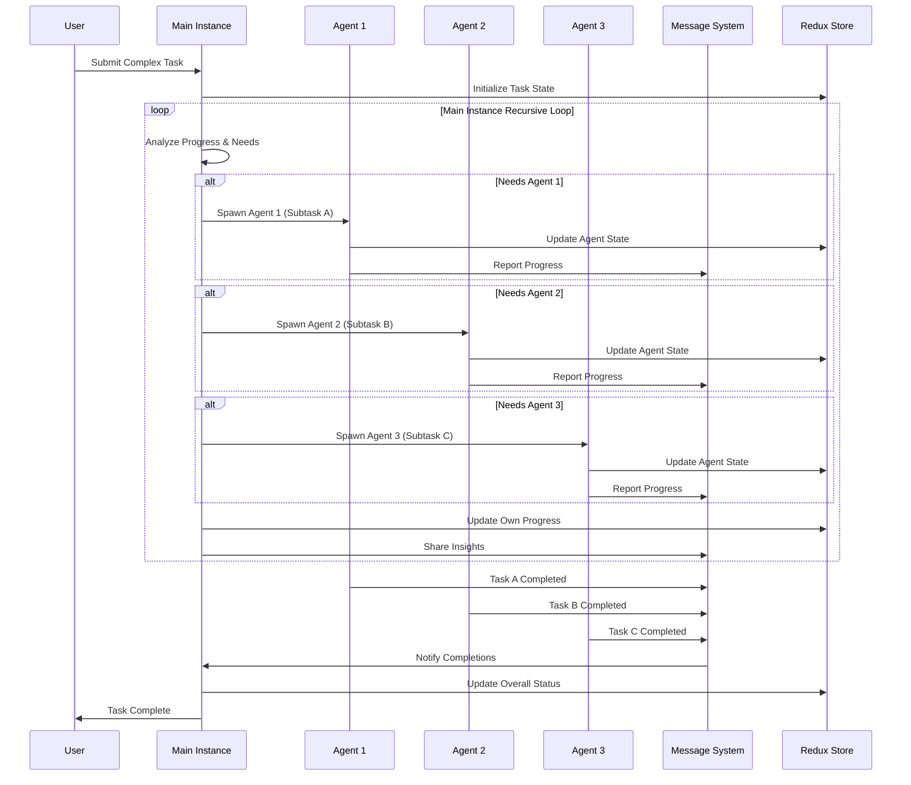
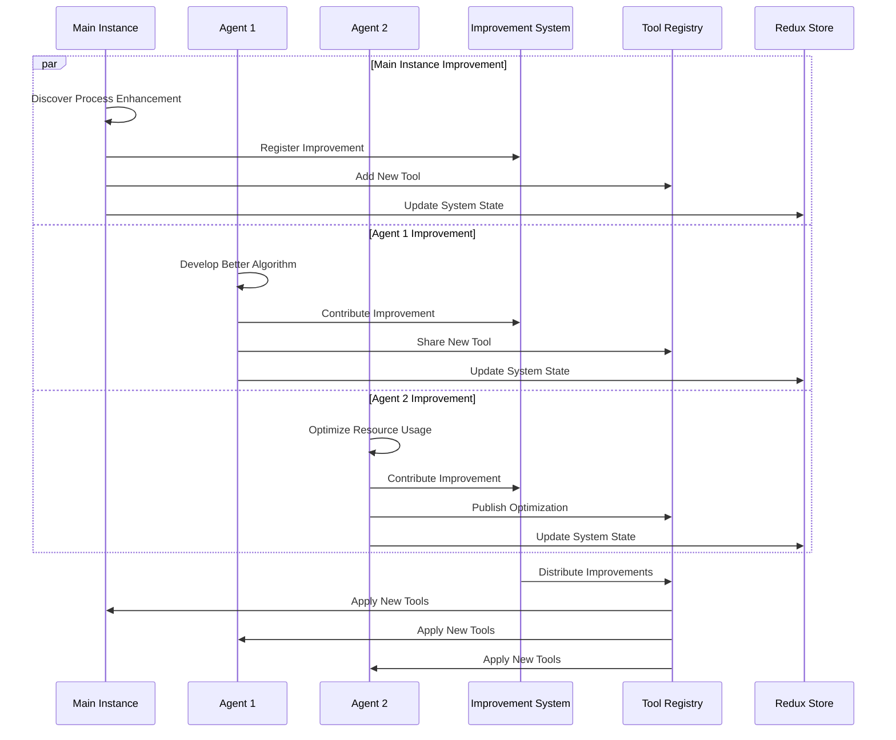
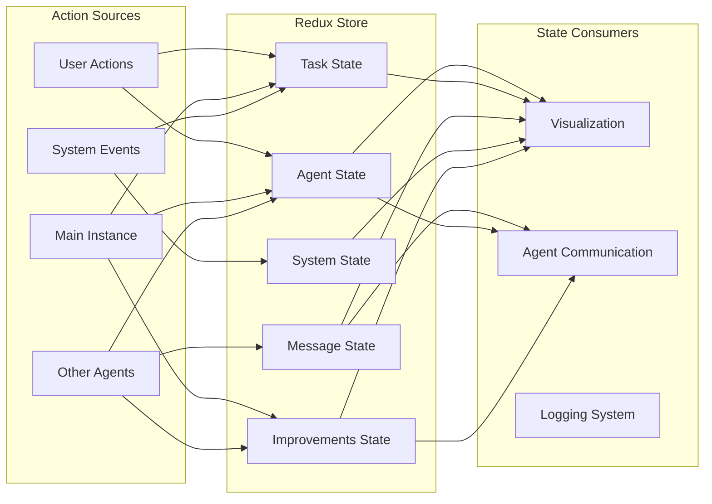

# Self-Improving Swarm System - Architecture Diagram

## High-Level System Architecture

```mermaid
graph TB
    subgraph "User Interface Layer"
        UI[User Interface]
        VIZ[Real-time Visualizer]
    end
    
    subgraph "Application Layer"
        MAIN[Main Recursive Instance<br/>(Continuous Orchestrator)]
        AGENT1[Agent 1]
        AGENT2[Agent 2]
        AGENTN[Agent N...]
        
        MAIN -- "Spawns at any time during recursion" --> AGENT1
        MAIN -- "Spawns at any time during recursion" --> AGENT2
        MAIN -- "Spawns at any time during recursion" --> AGENTN
    end
    
    subgraph "State Management Layer"
        REDUX[(Redux Store)]
        AGENT_STATE[Agent State Slice]
        TASK_STATE[Task State Slice]
        MSG_STATE[Message State Slice]
        SYS_STATE[System State Slice]
        IMPROVE_STATE[Improvements State Slice]
    end
    
    subgraph "Communication Layer"
        MSG_BUS[Message Bus]
        INBOX[Shared Inbox]
        OUTBOX[Shared Outbox]
    end
    
    subgraph "Tool Management Layer"
        TOOL_REG[Tool Registry]
        DYN_TOOL[Dynamic Tool Creation]
        SELF_IMPROVE[Self-Improvement System]
    end
    
    UI --> MAIN
    VIZ --> REDUX
    
    MAIN <--> REDUX
    AGENT1 <--> REDUX
    AGENT2 <--> REDUX
    AGENTN <--> REDUX
    
    MAIN <--> MSG_BUS
    AGENT1 <--> MSG_BUS
    AGENT2 <--> MSG_BUS
    AGENTN <--> MSG_BUS
    
    MSG_BUS <--> INBOX
    MSG_BUS <--> OUTBOX
    
    MAIN <--> TOOL_REG
    AGENT1 <--> TOOL_REG
    AGENT2 <--> TOOL_REG
    AGENTN <--> TOOL_REG
    
    TOOL_REG <--> DYN_TOOL
    MAIN <--> SELF_IMPROVE
    AGENT1 <--> SELF_IMPROVE
    AGENT2 <--> SELF_IMPROVE
    AGENTN <--> SELF_IMPROVE
    
    REDUX -.-> |State Updates| VIZ
    MSG_BUS -.-> |Real-time Messages| VIZ
```

## Continuous Agent Spawning Flow



## Self-Improvement Contribution Flow



## Redux State Flow



## Component Interaction Matrix

| Component | Main Instance | Agent | Redux | Message System | Visualization | Tool Registry | Improvement System |
|-----------|---------------|-------|-------|----------------|---------------|---------------|-------------------|
| Main Instance | Self (Recursive) | Spawns as needed | Reads/Writes | Sends/Receives | Provides Data | Creates/Uses | Contributes |
| Agent | Receives from | Self | Reads/Writes | Sends/Receives | Provides Data | Creates/Uses | Contributes |
| Redux | Updates State | Updates State | Core | Notifies | Provides State | Updates State | Updates State |
| Message System | Sends/Receives | Sends/Receives | Notifies | Core | Provides Messages | Routes Messages | Coordinates |
| Visualization | Receives Data | Receives Data | Subscribes | Subscribes | Core | Receives Tools | Receives Improvements |
| Tool Registry | Manages | Uses | Updates | Shares | Displays | Core | Integrates |
| Improvement System | Receives | Receives | Updates | Coordinates | Displays | Integrates | Core |

## Continuous Learning Flow for Complex Task Execution

```mermaid
flowchart TD
    START([User Submits Task]) --> MAIN_LOOP[Main Instance Recursive Loop]
    
    MAIN_LOOP --> ANALYZE[Analyze Current Progress]
    ANALYZE --> DECIDE{Need Additional Agent?}
    
    DECIDE -->|Yes| SPAWN[Spawn Specialized Agent]
    DECIDE -->|No| CONTINUE_SELF[Continue Self Processing]
    
    SPAWN --> A1[Agent 1: Subtask A]
    SPAWN --> A2[Agent 2: Subtask B]
    SPAWN --> AN[Agent N: Subtask ...]
    
    A1 --> UPDATE1[Update Redux State]
    A2 --> UPDATE2[Update Redux State]
    AN --> UPDATEN[Update Redux State]
    
    A1 --> COMM1[Communicate via Message System]
    A2 --> COMM2[Communicate via Message System]
    AN --> COMMN[Communicate via Message System]
    
    UPDATE1 --> VIZ[Visualization Updates]
    UPDATE2 --> VIZ
    UPDATEN --> VIZ
    COMM1 --> VIZ
    COMM2 --> VIZ
    COMMN --> VIZ
    
    A1 --> CHECK1{Task Complete?}
    A2 --> CHECK2{Task Complete?}
    AN --> CHECKN{Task Complete?}
    
    CHECK1 -->|No| A1
    CHECK1 -->|Yes| REPORT1[Report Result to Main]
    CHECK2 -->|No| A2
    CHECK2 -->|Yes| REPORT2[Report Result to Main]
    CHECKN -->|No| AN
    CHECKN -->|Yes| REPORTN[Report Result to Main]
    
    REPORT1 --> MAIN_LOOP
    REPORT2 --> MAIN_LOOP
    REPORTN --> MAIN_LOOP
    
    CONTINUE_SELF --> SELF_CHECK{Self Task Complete?}
    SELF_CHECK -->|No| MAIN_LOOP
    SELF_CHECK -->|Yes| COLLECT[Collect All Results]
    
    COLLECT --> SYNTHESIZE[Synthesize Final Result]
    SYNTHESIZE --> COMPLETE([Task Complete])